# SPEC-001-Upload Management System (League)

## Background

League members and Customer Care agents need a unified, reliable way to manage documents that support benefits and claims across web and mobile experiences. Today, uploads exist in disparate flows (e.g., claims vs. profile), creating duplicated logic, inconsistent UX, and scattered metadata. A new upload management system should:

* Provide a single, reusable front-end module for initiating uploads, tracking progress, attaching metadata, and viewing/editing/deleting documents across contexts (claims, profile, memberships, etc.).
* Support multiple personas: **Member** (primary uploader/manager) and **Customer Care Agent** (reviewer/validator) with role-aware UX and permissions.
* Work consistently across **iOS**, **Android**, and **Web**, with offline-tolerant behavior for mobile and resilient retry semantics.
* Handle sensitive PII/PHI documents (IDs, prescriptions, receipts) with strong client-side safeguards, least-privilege access, and auditable interactions.
* Make it simple to associate documents with business entities (e.g., Claim #123, Member Profile, Dependent, Benefit Plan Year) without duplicating files.
* Offer a scalable foundation for future features like document classification, OCR extraction, and automated redaction.

**Assumptions (to validate):**

* League ships a React-based web app and a React Native mobile app using TypeScript in a shared monorepo; design will target both.
* Regulated data may include PHI/PII; compliance constraints could include HIPAA (US) and/or PIPEDA (CA), plus data residency requirements.
* Server/storage will provide pre-signed URLs (or equivalent) and scanning hooks; front-end must support chunked/resumable uploads and content scanning gates.

## Requirements

**MoSCoW Prioritization (IDs for reference)**

**Must Have**

* **R-M-1 Uploads:** Members can upload images/PDFs (camera, gallery, files) with chunked/resumable transfer and progress; default limits: up to **200 MB/file**, **50 files/batch**.
* **R-M-2 View & Preview:** Members and Agents can list, search, sort, and preview images/PDFs; grid/list views; thumbnails; pagination/infinite scroll.
* **R-M-3 Metadata:** Title, category (e.g., Receipt, Prescription, ID), tags, associated entity (Claim ID, Profile, Dependent, Plan Year), document date, notes.
* **R-M-4 Edit:** Edit metadata; replace file to create a new **version** while retaining history; show latest by default.
* **R-M-5 Delete (Soft):** Soft delete with retention (**90 days**) and legal-hold override; restore within retention.
* **R-M-6 Role-Aware Access:** Member vs. Agent views with RBAC/ABAC checks; agents can view all claim-linked docs relevant to their queue.
* **R-M-7 Security & Privacy:** TLS, pre-signed URL uploads/downloads, least-privilege scopes, audit trail (who/when/what), no local persistent copies by default, optional watermark on previews for agents.
* **R-M-8 Compliance:** HIPAA/PIPEDA UI safeguards (PHI indicators, consent prompts for sensitive uploads), inactivity lock, privacy notices.
* **R-M-9 Offline & Retry (Mobile):** Queue uploads offline, background retries with exponential backoff; conflict resolution on metadata edits.
* **R-M-10 Accessibility & i18n:** WCAG 2.2 AA, keyboard and screen reader support, localization, and timezone-aware timestamps.
* **R-M-11 Observability:** Front-end telemetry (upload duration, failure codes, retry counts), UX health metrics, error reporting, feature flags.

**Should Have**

* **R-S-1 Content Safety Gate:** AV/malware scan + DLP pattern checks (SSN, credit card) with user-friendly failure states.
* **R-S-2 OCR Assist:** Optional OCR for receipts/prescriptions to pre-fill metadata (amount, date, merchant).
* **R-S-3 Duplicate Detection:** Client content hash (e.g., SHA-256) to warn on duplicates before upload.
* **R-S-4 Bulk Actions:** Multi-select delete/restore/relink, bulk metadata edits.
* **R-S-5 Annotations:** Basic redaction boxes and highlights in viewer (non-destructive overlay stored as metadata).
* **R-S-6 Version History UI:** Diff of metadata across versions; revert to prior version.

**Could Have**

* **R-C-1 Auto Classification:** On-device or server hinting (e.g., "Looks like a receipt").
* **R-C-2 Expiry & Reminders:** Track doc expiry (IDs, memberships) and notify members to refresh.
* **R-C-3 e-Signature Integration:** For forms requiring signatures.
* **R-C-4 Advanced Search:** Facets on category, entity, tags, amount (from OCR), date ranges.
* **R-C-5 Time-bound Sharing:** Secure, expiring links for providers (policy permitting).

**Won’t Have (for MVP)**

* **R-W-1** Claim submission flow itself (handled elsewhere; this module embeds there for attachments only).
* **R-W-2** Full offline viewing of never-fetched documents (only cached previews where available).
* **R-W-3** In-app pixel-level image editing beyond crop/rotate; heavy redaction baked into file (use overlays instead).
* **R-W-4** Storing files within app sandbox long-term; no background export to device storage by default.

## Method

### Front-End Architecture Overview

**Tech choices (web & mobile RN)**

* **Data fetching & caching:** TanStack Query (Query/Mutation, retries, optimistic updates, offline persistence). ([tanstack.com](https://tanstack.com/blog/announcing-tanstack-query-v5?utm_source=chatgpt.com))
* **Upload transport:** Prefer **tus** for chunked/resumable uploads where supported; fall back to pre-signed URL multipart (e.g., S3 via Uppy or native APIs). ([tus.io](https://tus.io/?utm_source=chatgpt.com))
* **Forms & schema validation:** React Hook Form + Zod for fast, type-safe metadata forms. ([react-hook-form.com](https://react-hook-form.com/docs?utm_source=chatgpt.com))
* **State orchestration:** XState for the upload lifecycle (idle→queued→uploading→verifying→complete/failed/canceled). ([stately.ai](https://stately.ai/docs?utm_source=chatgpt.com))
* **PDF preview:** PDF.js (web) / native viewer intents (mobile). ([npmjs.com](https://www.npmjs.com/package/pdfjs-dist?utm_source=chatgpt.com))
* **Document picking (RN):** `@react-native-documents/picker` (modern rewrite) or `react-native-document-picker` as fallback. ([npmjs.com](https://www.npmjs.com/package/%40react-native-documents/picker?utm_source=chatgpt.com))

> **Why this stack?** It standardizes retries/caching (TanStack Query), gives resilient resumable uploads (tus/multipart), robust form UX (RHF + Zod), and deterministic flow control (XState). All are mature and actively maintained.

### Module Boundaries

* **Upload Core SDK (shared TS lib):**

  * File selection adapters (Web: `<input type=file>`/drag-drop; RN: Document Picker/Camera Roll).
  * Upload client: tus + multipart; chunk size auto-tuned; pause/resume/cancel; checksums; progress events.
  * Offline queue & persistence (RN: AsyncStorage; Web: IndexedDB) with exponential backoff.
  * Security: preflight (type/size), client hash for duplicate warn, content sniff.
  * Telemetry hooks (OpenTelemetry-friendly) for timing, errors, retry counts.

* **UI Package:**

  * **Uploader Widget** (dropzone, picker, queue list, progress, pause/resume, cancel, retry).
  * **Metadata Form** (title, category, tags, entity link, date, notes) with schema from Zod.
  * **Document Gallery** (grid/list, filters, facets, infinite scroll, bulk actions).
  * **Document Viewer** (image/PDF preview, zoom, rotate, annotations overlay, version switcher).

* **Feature Integrations:**

  * **Profile Docs**, **Recurring Docs**, **Claim Attachments**, **Agent Review Console** consume UI/SDK via props and route guards.

### Data & Entity Model (front-end)

```ts
// Shared types (simplified)
export type DocCategory = 'RECEIPT'|'PRESCRIPTION'|'ID'|'BENEFICIARY_FORM'|'OTHER';
export interface DocumentRef {
  id: string;              // stable id
  versionId: string;       // current version id
  ownerMemberId: string;
  categories: DocCategory[];
  title: string;
  tags: string[];
  entityLinks: Array<{ type: 'CLAIM'|'PROFILE'|'DEPENDENT'|'PLAN_YEAR'; id: string }>;
  docDate?: string;        // ISO
  notes?: string;
  mimeType: string;
  sizeBytes: number;
  createdAt: string; updatedAt: string;
  deleted?: { at: string; reason?: string };
  previewUrl?: string;     // short-lived or proxy URL
}
```

### UI States & Flows (XState)

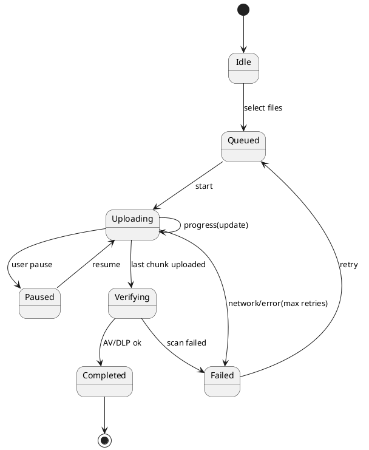

### Sequence: Member Upload with Metadata & Claim Link

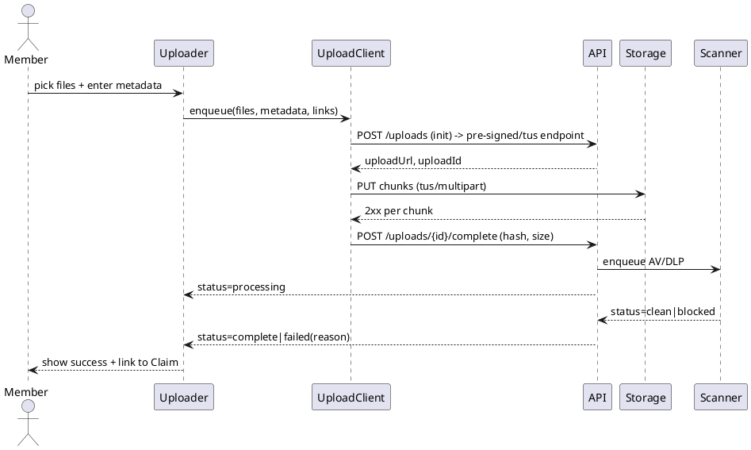

### Sequence: Agent Reviewing Documents for a Claim

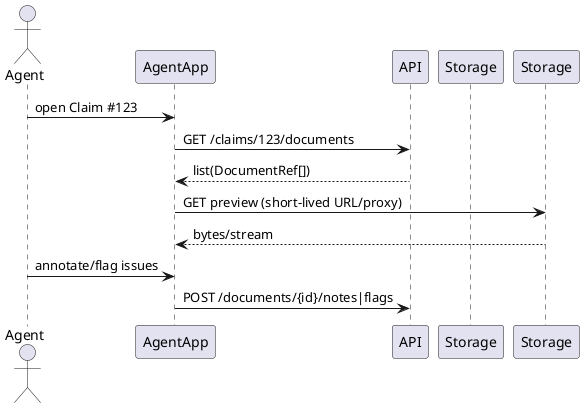

### Caching, Pagination & Search

* Lists use TanStack **infinite queries** with key `["documents", filters]`, server-driven cursors.
* Mutations invalidate precise keys (e.g., `["document", id]`, `["documents", {link: claimId}]`). ([tanstack.com](https://tanstack.com/blog/announcing-tanstack-query-v5?utm_source=chatgpt.com))

### Offline & Retry Strategy

* Queue persists unsent chunks; backoff with jitter; foreground & background (mobile) with OS constraints.
* Edits to metadata use **optimistic updates** w/ rollback on failure. ([tanstack.com](https://tanstack.com/blog/announcing-tanstack-query-v5?utm_source=chatgpt.com))

### Security & Privacy (front-end controls)

* **No long-term local storage** of files; blobs released after upload.
* All downloads/previews via short-lived URLs; revoke on view close.
* PHI banners & consent prompts on first upload per session.
* Watermark overlays in Agent preview (e.g., "For Review – {agentId} – {timestamp}").

### Accessibility & i18n

* Keyboard-accessible dropzone, ARIA live regions for progress, screen-reader friendly labels.
* Localized copy; timezone-aware timestamps.

### Notable Libraries & Docs

* **TanStack Query v5** for queries/mutations/offline. ([tanstack.com](https://tanstack.com/blog/announcing-tanstack-query-v5?utm_source=chatgpt.com))
* **tus / tus-js-client** for resumable uploads; **Uppy S3** for multipart. ([tus.io](https://tus.io/?utm_source=chatgpt.com))
* **React Hook Form** + **Zod** for metadata forms. ([react-hook-form.com](https://react-hook-form.com/docs?utm_source=chatgpt.com))
* **PDF.js** for web PDF previews; native intents for RN. ([npmjs.com](https://www.npmjs.com/package/pdfjs-dist?utm_source=chatgpt.com))
* **React Native document picker** modern packages. ([npmjs.com](https://www.npmjs.com/package/%40react-native-documents/picker?utm_source=chatgpt.com))

## Implementation

### 1) Packages & Monorepo Structure

```
/apps
  /web (React + Vite)
  /mobile (React Native)
/packages
  /upload-core        # transport, queue, state machine, telemetry hooks
  /upload-ui          # reusable UI components (web+RN via platform files)
  /doc-viewer         # image/PDF viewer, annotations overlay
  /types              # shared DTOs & Zod schemas
  /testing            # test utils, msw handlers, fixtures
```

### 2) Shared Types & Validation (packages/types)

```ts
// zod schemas
export const DocCategory = z.enum(['RECEIPT','PRESCRIPTION','ID','BENEFICIARY_FORM','OTHER']);
export const EntityLink = z.object({ type: z.enum(['CLAIM','PROFILE','DEPENDENT','PLAN_YEAR']), id: z.string().min(1)});
export const MetadataSchema = z.object({
  title: z.string().min(1).max(120),
  categories: z.array(DocCategory).min(1),
  tags: z.array(z.string().min(1)).max(25).default([]),
  entityLinks: z.array(EntityLink).max(10),
  docDate: z.string().datetime().optional(),
  notes: z.string().max(2000).optional(),
});
export type Metadata = z.infer<typeof MetadataSchema>;
```

### 3) Upload Core (packages/upload-core)

* **Responsibilities:** file selection adapters, hashing (SHA-256 streaming), tus/multipart engines, offline queue (IndexedDB/AsyncStorage), backoff + pause/resume, duplicate detection, telemetry, audits.
* **Key APIs:**

```ts
export interface UploadInit {
  file: FileLike; // Blob | RN File
  metadata: Metadata;
  context: { entityLinks: Metadata['entityLinks']; source: 'PROFILE'|'CLAIM'|'RECURRING'; }
}
export interface UploadHandle {
  id: string; status: 'queued'|'uploading'|'paused'|'verifying'|'completed'|'failed';
  progress: { bytesSent: number; totalBytes: number };
  pause(): void; resume(): void; cancel(): void; retry(): void;
}
export interface UploadClient {
  enqueue(items: UploadInit[]): Promise<UploadHandle[]>;
  on(event: 'progress'|'status'|'completed'|'failed', cb: (u: UploadHandle)=>void): Unsub;
  listQueue(): UploadHandle[];
}
```

* **Engines:**

  * `TusEngine` with 5–10 MB chunks; checksum per chunk; metadata headers.
  * `MultipartEngine` for S3-style multipart: 8–16 MB parts; parallel uploads (concurrency=4–6); finalization via ETags.
  * Automatic selection based on `capabilities` returned by `POST /uploads`.
* **Offline:** queue persisted as `uploadQueue` store; resume by `uploadId` and engine state.
* **Security:** preflight reject if mime/size invalid; compute SHA-256 to enable server-side dedupe.
* **Telemetry hooks:** events emitted with timing, retry counts, error codes.

### 4) UI Components (packages/upload-ui)

* `UploaderWidget` (dropzone/picker + queue panel)

```tsx
<UploaderWidget
  maxSizeMB={200}
  accept={{ 'application/pdf': ['.pdf'], 'image/*': ['.jpg','.jpeg','.png','.heic'] }}
  defaultCategory="RECEIPT"
  getContext={()=>({ entityLinks:[{type:'PROFILE', id:memberId}], source:'PROFILE' })}
  onCompleted={(docs)=> navigateToGallery(docs)}
/>
```

* `MetadataForm` (RHF + Zod resolver) with autosave and optimistic updates.
* `DocumentGallery` (infinite query, filters, bulk actions) — SSR friendly on web.
* `DocumentViewer` (image/PDF preview, zoom, rotate, version switcher, watermark for agents, annotation overlays stored as JSON).

### 5) Data Fetching & Caching (TanStack Query)

```ts
// keys
const docKey = (id:string)=> ['document', id];
const docListKey = (filters:any)=> ['documents', filters];

// list documents
useInfiniteQuery({
  queryKey: docListKey(filters),
  queryFn: ({pageParam}) => api.get('/documents', { params: { ...filters, cursor: pageParam } }),
  getNextPageParam: r => r.nextCursor,
});

// edit metadata
useMutation({
  mutationFn: (input)=> api.patch(`/documents/${input.id}`, input.payload),
  onMutate: async (input)=> { /* optimistic update */ },
  onError: (e, input, ctx)=> rollback(ctx),
  onSuccess: ()=> queryClient.invalidateQueries({ queryKey: docKey(input.id) }),
});
```

### 6) API Contracts (front-end expectations)

```
POST   /uploads                     -> { uploadId, engine: 'tus'|'multipart', uploadUrl, parts?, capabilities }
POST   /uploads/{id}/complete       -> { documentId, versionId, status: 'processing'|'complete' }
GET    /documents?filters...        -> { items: DocumentRef[], nextCursor? }
GET    /documents/{id}              -> DocumentRef
PATCH  /documents/{id}              -> DocumentRef (new versionId if file replaced)
DELETE /documents/{id}              -> 204 (soft delete)
POST   /documents/{id}/restore      -> DocumentRef
GET    /claims/{id}/documents       -> { items: DocumentRef[] }
POST   /documents/{id}/annotations  -> { annotations: Annotation[] }
```

* Short-lived **preview URLs** returned by API or served via proxy; never store long-term in clients.

### 7) Access Control (front-end enforcement)

* Route guards by role (Member/Agent); component-level feature flags.
* Conditional rendering for restricted actions (delete/restore/edit) based on permissions from `/me/permissions` and per-document ACL snippet returned with `DocumentRef` (e.g., `{ canEdit, canDelete, canViewVersions }`).

### 8) Error Handling UX

* Upload queue shows per-file error chips with actionable retry.
* DLP/AV failures display precise reason (e.g., "Credit card detected"), offer **Replace** or **Remove**.
* Network issues surface **Retry All** with backoff countdown.

### 9) Security & Privacy Controls (client-side)

* Input validation & MIME sniff; block executable types.
* Redaction overlays are **client-stored JSON**, not baked into source file (server can export flattened if needed).
* Watermark: composite canvas layer in viewer for Agents: `For Review – {agentName} – {timestamp}`.
* Inactivity lock for Agent Console; hides previews until re-auth.

### 10) Performance

* Thumbnails via server-generated low-res images; lazy-load with IntersectionObserver.
* Web workers for hashing + image downscaling previews.
* RN: use `MMKV`/`AsyncStorage` for queue metadata; avoid large blob persistence.

### 11) Testing Strategy

* **Unit:** upload-core engines, hashers, state machine transitions.
* **Integration:** msw to stub API; simulate chunk errors, AV/DLP failures, resumptions.
* **E2E:** Playwright (web) and Detox (mobile) for flows: upload->verify->complete, metadata edit, soft delete/restore, agent review.
* **Accessibility:** axe-core on web, RN AccessibilityInfo checks.

### 12) Telemetry & Observability

* OpenTelemetry-compatible events: `upload_started`, `chunk_uploaded`, `upload_failed`, `upload_completed`, `metadata_updated` with attributes (size, mime, engine, retries, networkType).
* Error correlation id from server echoed back in client logs.

### 13) Feature Flagging & Rollout

* Flags: `uploads.tus`, `uploads.multipart`, `uploads.annotations`, `uploads.ocrAssist`.
* Gradual rollout by cohort; kill switches on failure rate thresholds.

### 14) CI/CD Notes

* Type checks and lint block merges; run unit/integration suites on PR.
* Storybook for `upload-ui` with visual regression tests (Chromatic or equivalent).
* Bundle-size guardrails (e.g., UploaderWidget < 75kb gz web-only).

### 15) Mobile Considerations

* Background upload tasks respecting OS constraints; resume on app foreground.
* Camera integration (if allowed) with pre-upload downscale option.
* iOS HEIC support → convert to JPEG server-side or warn where unsupported.

### 16) Sample Screens (component contracts)

* **Member Gallery**

```tsx
<DocumentGallery
  filters={{ owner: memberId, link: { type:'PROFILE', id: memberId } }}
  onOpen={(doc)=> openViewer(doc)}
  onBulkAction={(action, ids)=> handleBulk(action, ids)}
/>
```

* **Agent Review Panel**

```tsx
<ClaimDocumentsPanel
  claimId={claimId}
  showWatermark
  onAnnotate={(id, notes)=> api.post(`/documents/${id}/annotations`, notes)}
/>
```

### 17) Deployment Diagram (front-end perspective)

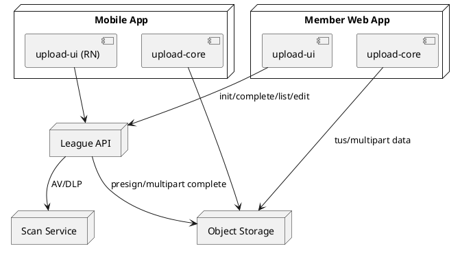

## Milestones

**Overall timeline:** ~6 sprints (2 weeks each). Parallelize web/RN where noted.

### Sprint 1 – Foundations & SDK skeleton

* Monorepo packages scaffold (`upload-core`, `upload-ui`, `doc-viewer`, `types`).
* XState upload lifecycle; basic enqueue/pause/resume/cancel.
* Multipart engine stub with mock server; hashing worker.
* Storybook set up; unit tests baseline; telemetry event schema.

**Exit criteria:** Upload queue runs with mocks; progress visible; 80% unit coverage on core state machine.

### Sprint 2 – Transport engines & offline

* Implement tus + S3 multipart engines; auto-select via capabilities.
* Offline queue persistence (IndexedDB/AsyncStorage) with backoff & resume.
* Duplicate detection (SHA-256) and MIME/size preflight.

**Exit criteria:** Kill-the-network tests pass; resume after relaunch; duplicate warning works.

### Sprint 3 – UI widgets & metadata

* UploaderWidget (drop, picker, queue UI) + MetadataForm (RHF+Zod) with validation and autosave.
* DocumentGallery (infinite list, filters) with server API integration.
* Accessibility pass (keyboard, SR labels) and i18n plumbing.

**Exit criteria:** Upload + metadata + gallery E2E (web) green; WCAG checks score AA on core flows.

### Sprint 4 – Viewer, versions, delete/restore

* DocumentViewer with PDF.js (web) / native intents (RN), zoom/rotate.
* Version replacement flow (new file → new versionId), soft delete + restore.
* Agent watermark overlay; role-aware controls.

**Exit criteria:** Replace file creates new version; soft delete/restore functional; agent watermark visible.

### Sprint 5 – Scanning, claims integration, telemetry

* Integrate AV/DLP scan states in UI (processing → complete/failed) and failure UX.
* Claims module embedding for attachments; Agent ClaimDocumentsPanel.
* Telemetry dashboards (upload latency, failure rate, retries) + alerts.

**Exit criteria:** Scan-failure UX validated; claim screen shows associated docs; dashboards populated in staging.

### Sprint 6 – Hardening & launch

* Performance tuning (chunk/part size, concurrency), memory/leak checks.
* Security review (watermarks, short-lived URLs, inactivity lock) and pen test fixes.
* Final a11y, localization, Doc & runbooks; feature flags staged rollout.

**Exit criteria:** <2% upload failure at p50 traffic in staging; page perf and memory budget met; go-live approval.

## Gathering Results

### Success Metrics (KPIs)

* **Reliability:**

  * Upload success rate ≥ **98%** overall; ≤ **1%** repeated-failure sessions.
  * Scan turnaround p95 ≤ **25s**; verification-induced user wait time p95 ≤ **5s** (async state with toasts).
* **Performance:**

  * Time-to-first-preview (thumbnail) p75 ≤ **1.5s** on 4G; UI thread blocked ≤ **6ms** avg during progress updates.
  * Hashing throughput ≥ **150 MB/s** on desktop web workers; ≥ **40 MB/s** on mid-range mobile.
* **UX & Accessibility:**

  * Task completion (upload+metadata) success ≥ **95%** unassisted in usability tests.
  * WCAG 2.2 AA audit: **0** critical violations.
* **Agent Efficiency:**

  * Time-to-open first supporting doc from claim queue ≤ **2.0s** p75.
  * Reduction in back-and-forth requests for missing docs by **20%** post-launch (proxy for better guidance/metadata).

### Monitoring & Alerts

* **Error budgets** for `upload_failed` and `scan_failed` events; alert on 30-min rolling window breach.
* **SLOs:** 99.9% availability for init/complete API; 99% for preview delivery.
* **Dashboards:** upload latency histograms, retries per engine, offline queue length, agent preview latency, DLP failure categories.

### QA & Experimentation

* **A/B**: UploaderWidget layout variants (queue-first vs. metadata-first) to improve completion time.
* **Dark launches** via feature flags before GA; shadow telemetry (no user-visible changes) to compare engines.

### Acceptance Tests (sample)

* Upload 10× 20 MB PDFs over flaky network → 10/10 succeed with ≤ 3 retries each; session remains responsive.
* Replace file → new versionId; history shows both; latest visible by default.
* Soft delete then restore within 90 days → document returns to gallery.
* DLP failure displays actionable reason with Replace/Remove choices.
* Agent view: open Claim → list shows all linked docs; watermark present; annotations save.

### Post-Launch Review (30/60/90 days)

* **30d:** KPI review, top failure codes, UX friction list; fix-it sprint.
* **60d:** Evaluate OCR Assist, Duplicate Detection impact; decide next investments (Auto Classification, Expiry Reminders).
* **90d:** Accessibility re-audit, localization QA, performance regression check; plan v2 roadmap.

# Appendix: PlantUML Sequence Diagrams

> Copy/paste any block into a PlantUML renderer.

### A1. Upload Initialization (Capabilities + Pre-signed)

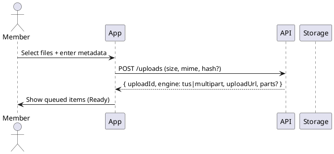

### A2. Resumable Upload With Network Drop & Resume

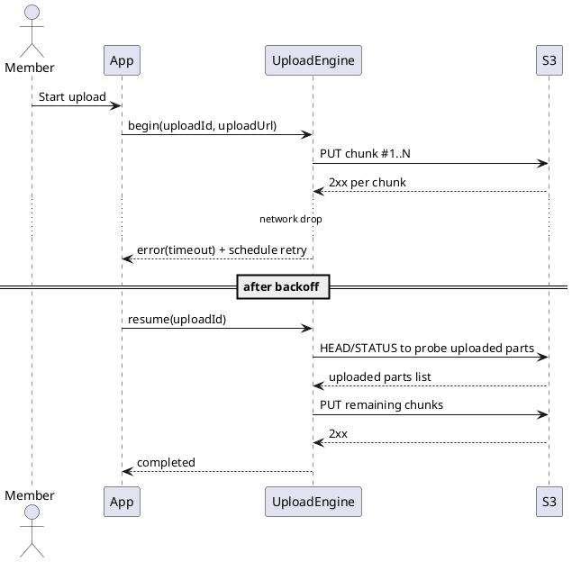

### A3. Upload Completion → Scan → Finalize

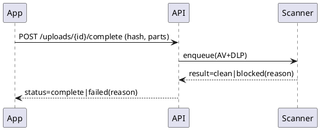

### A4. Metadata Edit (Optimistic Update with Rollback)

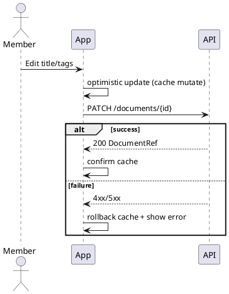

### A5. Replace File → New Version (Keeps History)

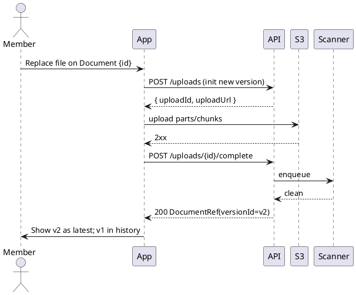

### A6. Soft Delete and Restore

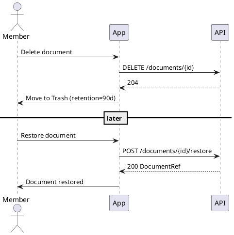

### A7. Agent Views Claim Docs + Watermarked Preview

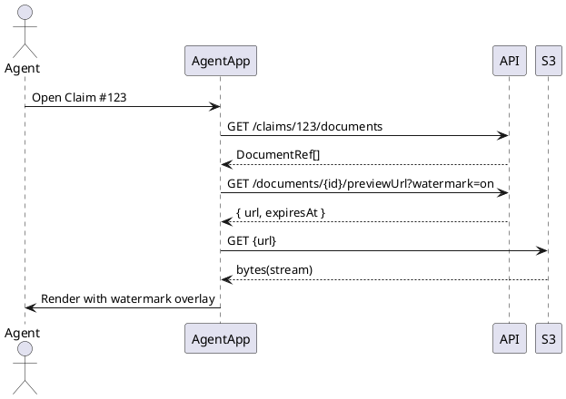

### A8. Offline Queue on App Relaunch (Mobile)

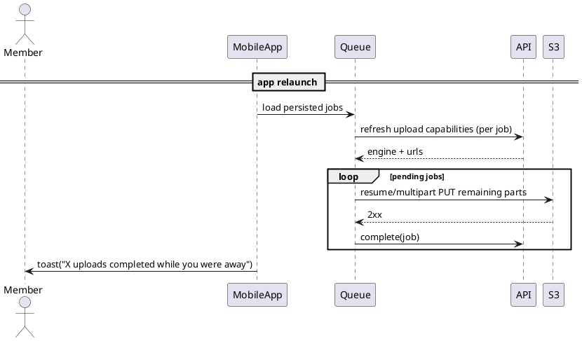
